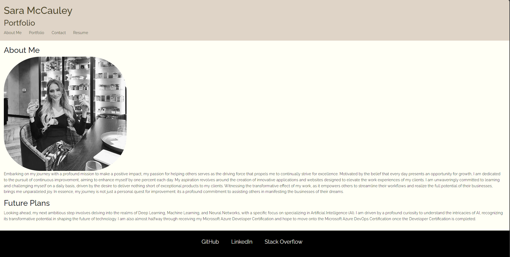

# Vite_Blog

## Description
This is a single-page application portfolio for a web developer built using Vite. It showcases the my personal projects, contact information, and resume.

## Table of Contents

- Description
- Table of Contents
- Installation
- Technology
- Questions
- Link
- Screenshot

## Installation
1. Clone the repository: `git@github.com:sarahizar/Dev_Blog.git`
2. Navigate to the project directory: `cd Dev_Blog`
3. Install server and client dependencies: `npm run install`
4. Start the development server: `npm run dev`

## Technology
- React
- Vite
- Netifly

## Questions 
If you have any questions, please feel free to reach out:
- GitHub: [sarahizar](https://github.com/sarahizar)
- Email: sara.hizar@outlook.com

## Link
https://github.com/sarahizar/viteblog

## Screenshot

